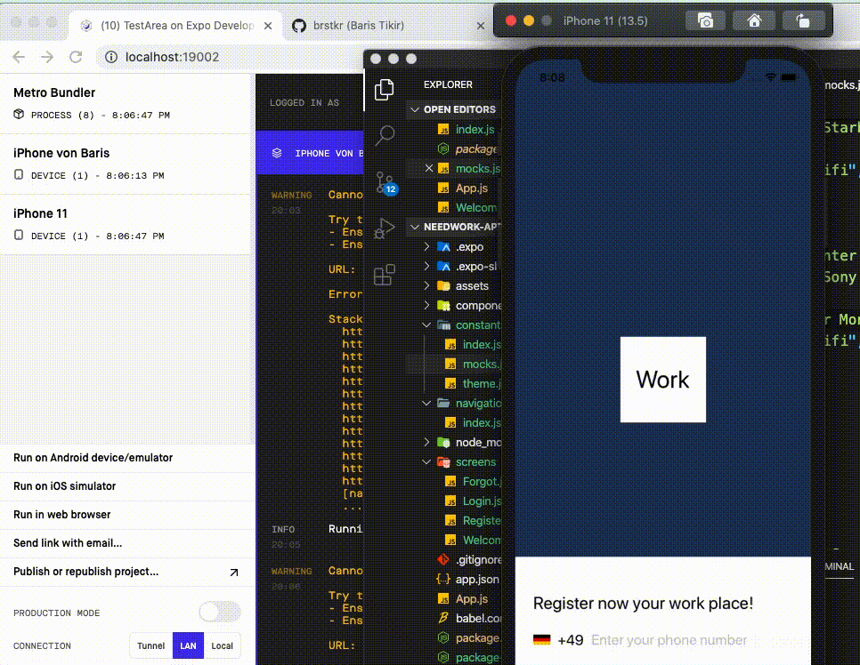

## Usage 📙

```shell
yarn install
yarn start
```

## What is this repository for? 
Only for learning and testing purposes. Currrent development is with Swift and Java for the front-end and ASP.NET Core (C#) for the back-end. The same app below was built in React Native and in Flutter to have the best comparison between them.

## How it looks 🚀

